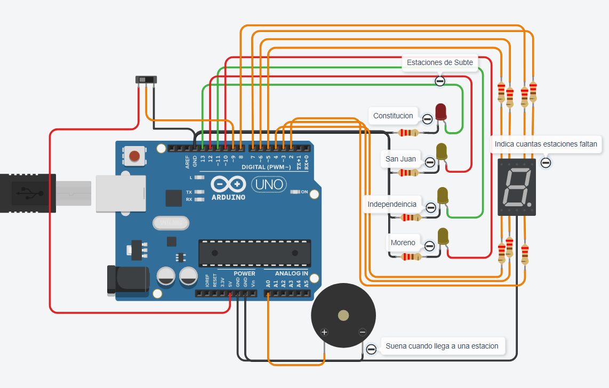

# Ejercicio_estacion_subte_SPD

## Integrante
- Pablo Abel Toledo

## Proyecto: Estacion de subte.

## Descripción
Este proyecto simula el recorrido de Plaza Constitucion hasta Moreno de la estacion de subte linea c  

## Funciónes principal
Esta funcion se encarga de encender los led y un display en cuanto el subte va reccorriendo cada estacion advirtiendo en cual se encuentra, al mismo cuanto falta para terminar el recorrido.

A, B, C, D, E, F, G: Son #define que utilizamos para agregar los segmentos del display, asociandolo a pines de la placa arduino.

(Breve explicación de la funciónes)

~~~ C (lenguaje en el que esta escrito)

void prenderLed(int tiempoEncendido, int tiempoApagado, int ledColor)
{
  digitalWrite(ledColor, HIGH);
  delay(tiempoEncendido);
  digitalWrite(ledColor, LOW);
  delay(tiempoApagado);
}  

void imprimeDigito(int digito) 
{
  const byte valoresSegmentos[4][7] = {
    {1, 1, 1, 1, 1, 1, 0},  // 0
    {0, 1, 1, 0, 0, 0, 0},  // 1
    {1, 1, 0, 1, 1, 0, 1},  // 2
    {1, 1, 1, 1, 0, 0, 1},  // 3
  };
  
  // Enciende o apaga los segmentos del dígito que paso por param 
  digitalWrite(A, valoresSegmentos[digito][0]);
  digitalWrite(B, valoresSegmentos[digito][1]);
  digitalWrite(C, valoresSegmentos[digito][2]);
  digitalWrite(D, valoresSegmentos[digito][3]);
  digitalWrite(E, valoresSegmentos[digito][4]);
  digitalWrite(F, valoresSegmentos[digito][5]);
  digitalWrite(G, valoresSegmentos[digito][6]);
}
~~~

## :robot: Link al proyecto 
- [proyecto](https://www.tinkercad.com/things/ewdjsMXAES6-ejerciciosubte/editel)
- [GDB del codigo](https://onlinegdb.com/fdNW2c_2N)
---
### Fuentes
- [Consejos para documentar](https://www.sohamkamani.com/how-to-write-good-documentation/#architecture-documentation).

- [Lenguaje Markdown](https://markdown.es/sintaxis-markdown/#linkauto).

- [Markdown Cheatsheet](https://github.com/adam-p/markdown-here/wiki/Markdown-Cheatsheet).

- [Tutorial](https://www.youtube.com/watch?v=oxaH9CFpeEE).

- [Emojis](https://gist.github.com/rxaviers/7360908).

---

